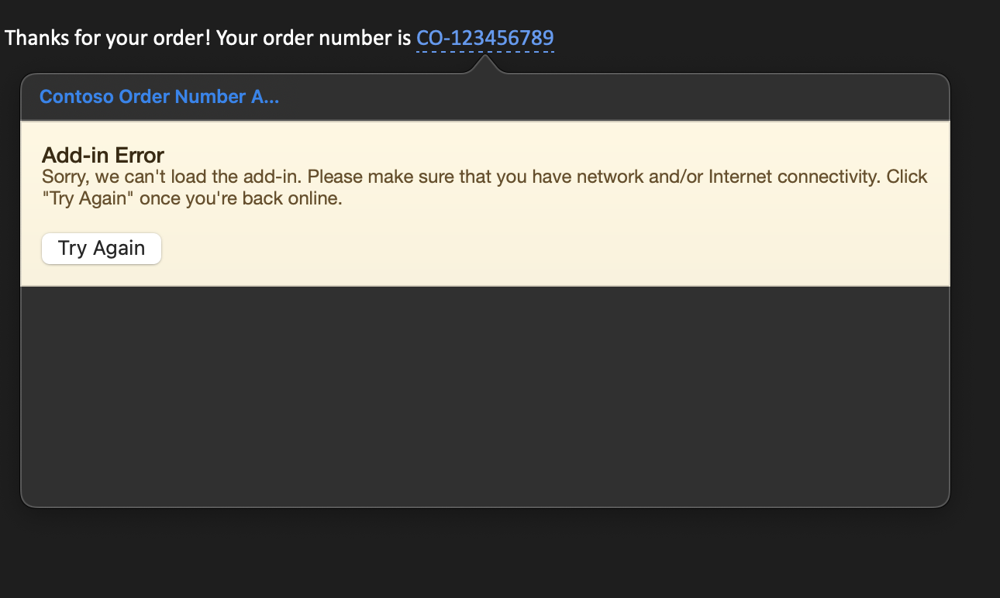

# My Problem with the Link and Email regex

## My Setup

I am using a mac book and the outlook app version: 16.77. I cloned this repo and manually added the add in to my outlook. It worked for the example and it was able to detect the order number and highlight the text. Inside the modal there is an error, because i don't have a running server for the html and js, as I want to have a proof of concept for the Link regex first.



I expected that the regex for the link would work similar, that is highlighted and clickable which opens the currently broken modal. But I am not able to activate the regex in any way i tried. The text is not highlighted and the link is not clickable, meaning that it does not open the modal and opens the link in a webbrowser as its default behavior, which is what i want to prevent.

## Observations

The link regex also breaks the add in completly as a side effect. When I try to use it, none of the other regex rules work. I tried this minimal regex: https and even that breaks the add-in and I think the problem is that links are clickable per default and that it conflicts with the add in which causes it to fail. To test this hypothesis I tried the same with an email regex. Emails also have a native onClick event in Outlook and yet again, adding an email regex to my manifest completly breaks the plugin. 


# This repo is cloned from the Contoso Order Number Example

## Outlook Add-in: Contoso Order Number

This sample add-in demonstrates how to create a [contextual add-in](https://docs.microsoft.com/office/dev/add-ins/outlook/contextual-outlook-add-ins) that activates when a regular expression match is detected in the body of a message.

The add-in detects fictitious Contoso order numbers with a specific format. The format used is `CO-` followed by 9 digits. When activated, the add-in simply displays both the selected order number and a list of all detected order numbers in the message.

> **Note:** Getting the selected order number relies on an API currently in preview, so it may not be available in all clients. If it is not, the add-in will indicate that it is not supported.

## Prerequisites

In order to try this add-in, you'll need:

- Office 365: If you don't already have Office 365, you can [register for a free 1-month trial](http://office.microsoft.com/try/?WT%2Eintid1=ODC%5FENUS%5FFX101785584%5FXT104056786).
- An SSL-protected web server: This can be any web server with an SSL certificate trusted by your client. If you don't have access to a web server, see [Running the add-in locally](running-locally.md) for steps to run a basic web server from the command line using Node.js and NPM.

## Configure the add-in

1. Unless you are going to run the add-in locally, copy the HTML, CSS, JavaScript, and PNG files from the project to your web server, maintaining the same directory layout.
1. Open the manifest (`contoso-order-number-manifest.xml`) in a text editor and replace all instances of `https://localhost:8080` with the URL to the directory where you copied the files in the previous step.
1. Verify that you can browse to the updated URLs in your manifest from your client using a browser. For example, you should be able to browse to the URL in the `<bt:Url id="detectedEntityURL">` element in the manifest and see the following page:

   

## Sideload the add-in

Follow the instructions at [Sideload Outlook add-ins for testing](https://docs.microsoft.com/office/dev/add-ins/outlook/sideload-outlook-add-ins-for-testing) to sideload the `contoso-order-number-manifest.xml` file.

## Try it out

1. Open [Outlook on the web](https://outlook.office.com).
1. Send yourself a message with a Contoso order number in the body. For example:

   ```text
   Thanks for your order! Your order number is CO-123456789.
   ```
